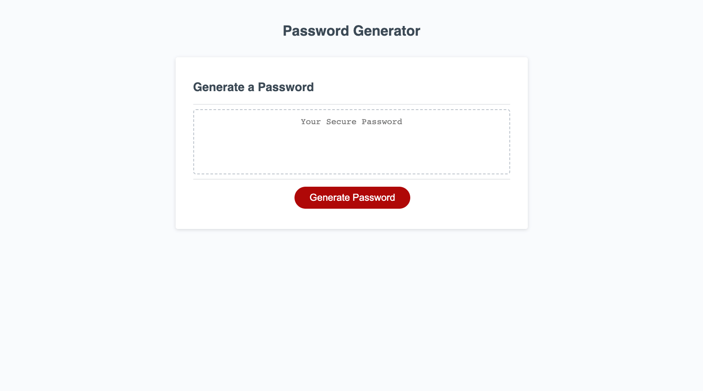

# Password-Generator

This application generates a random password with selected criteria.

## Description

This is my first JavaScript project. It's purpose is to get a firm understanding of JavaScript.

- I learned that JavaScript is a very interactive language.
- JavaScript has a lot of options for interactivity and output.

## Installation

N/A

## Usage

This can be used to generate a random password!

link: https://rtcottle.github.io/password-generator/

## Credits

README guide: https://coding-boot-camp.github.io/full-stack/github/professional-readme-guide
How to randomly choose an array item: https://www.w3resource.com/javascript-exercises/javascript-array-exercise-35.php
Randomization reference: https://stackoverflow.com/questions/4550505/getting-a-random-value-from-a-javascript-array

## License

Licensed under the  license.

## Badges

## Tests

Test this out, hit the generate password button and select your preferred criteria!
